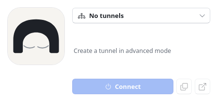
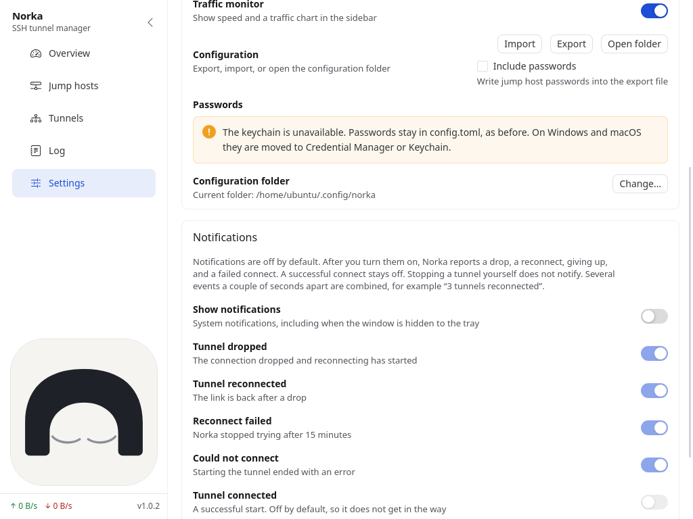
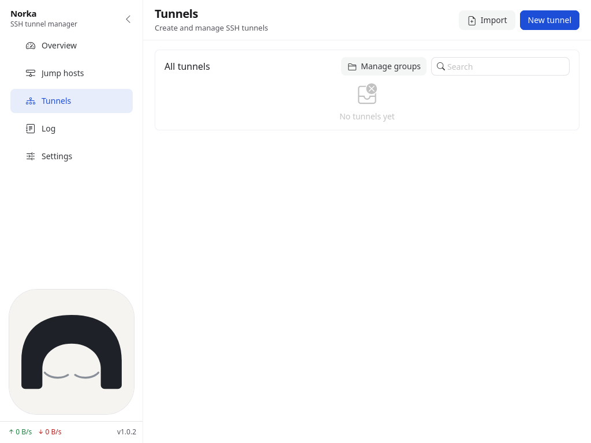

[Русский](README.md)

<div align="center">

<picture>
  <source media="(prefers-color-scheme: dark)" srcset="docs/images/banner-dark.png">
  
</picture>

**SSH tunnels in one window: connect, hide to the tray, forget.**

<sub>A tiny SSH tunnel manager for Windows, macOS and Linux with a burrow-dwelling mascot. The UI is in Russian and English.</sub>

<br>


[Download](../../releases) · [Features](#features) · [Build](#build-from-source) · [Configuration](#configuration)

</div>

---

## What it is

Norka creates and keeps SSH tunnels from a window, without typing a command every time you start. Tunnels go through one or more jump hosts. If the connection drops, the app reconnects on its own and shows the status in the window, in the tray, and in the mascot’s eyes.

<table>
<tr>
<td width="50%" valign="top">

**Simple mode** — a compact window for one tunnel

<picture>
  <source media="(prefers-color-scheme: dark)" srcset="docs/images/simple-dark.png">
  
</picture>

</td>
<td width="50%" valign="top">

**Quick switch** — the tunnel list inside the window

<picture>
  <source media="(prefers-color-scheme: dark)" srcset="docs/images/simple-list-dark.png">
  
</picture>

</td>
</tr>
</table>

**Advanced mode** — overview, jump hosts, tunnels, log, and settings

<picture>
  <source media="(prefers-color-scheme: dark)" srcset="docs/images/advanced-tunnels-dark.png">
  
</picture>

<details>
<summary>Another screenshot: Overview</summary>

<picture>
  <source media="(prefers-color-scheme: dark)" srcset="docs/images/advanced-overview-dark.png">
  
</picture>

</details>

<sub>Product shots are from Windows. Light and dark follow the GitHub theme. Host names are fictional. English UI shots are in [English interface](#english-interface).</sub>

---

## Features

- 🕳️ **Tunnels.** Local, remote, and dynamic SOCKS5. Groups, search, copy a tunnel, start with the app, and test the connection from the create dialog.
- 🧭 **Jump hosts.** Password, key file, or SSH Agent, keepalive, timeout, and a connection test before save. A chain of several jump hosts on one tunnel.
- 🪟 **Two window modes.** Advanced is the full interface. Simple is a compact window for one tunnel: status, address, uptime, copy address, and open in the browser. The simple window can stay above other windows. Switch from the title bar, the tray, or <kbd>Ctrl</kbd>+<kbd>Shift</kbd>+<kbd>M</kbd>.
- 🔌 **Port conflicts.** If another tunnel already holds the local port, Norka marks it “port busy” and offers “Connect instead” — it stops the other tunnel and starts the one you picked.
- 🧷 **Tray.** The icon color follows the overall status. Each tunnel has a submenu: connect or disconnect, copy the address, open in the browser. At the bottom: “Disconnect all”, “Retry failed”, and a jump to simple or advanced mode.
- 🔁 **Reconnect.** After a drop, an exponential pause from 0.5 s up to 1 minute, for up to 15 minutes. The list shows “Reconnecting”.
- 📈 **Traffic and latency.** Speed and a chart in the sidebar, SSH latency on each running tunnel.
- 📥 **Import.** Tunnels from an `ssh` command (`-L`, `-R`, `-D`). Jump hosts from an SSH config file, including `ProxyJump`.
- 🧾 **Log** of operations, filtered by level.
- 🎨 **Appearance.** Light and dark theme. A custom title bar with no system frame on Windows (native frame on macOS and Linux).
- 🌐 **Language.** In Settings: Auto (the system language — Russian for ru, English otherwise), Русский, or English. The window and the tray menu switch immediately.
- 🔔 **Notifications.** Off by default. When on, Norka can report a drop, a reconnect, giving up, and a failed connect. A successful connect stays off.
- 🔑 **Passwords.** Jump host passwords and key passphrases go to the OS keychain. `config.toml` keeps a reference. Export can include passwords only if you turn that on.
- ⚙️ **Settings.** Start at login, export and import `config.toml`, and choose a configuration folder.

---

## English interface

Settings → **Язык / Language**. Auto follows the system locale. The same choice is stored in `config.toml` (`language`) and applied to the tray.

<table>
<tr>
<td width="50%" valign="top">

**Simple mode**

<picture>
  <source media="(prefers-color-scheme: dark)" srcset="docs/pr/english-ui/simple-dark.png">
  
</picture>

</td>
<td width="50%" valign="top">

**Settings**

<picture>
  <source media="(prefers-color-scheme: dark)" srcset="docs/pr/english-ui/settings-dark.png">
  
</picture>

</td>
</tr>
</table>

**Tunnels**

<picture>
  <source media="(prefers-color-scheme: dark)" srcset="docs/pr/english-ui/tunnels-dark.png">
  
</picture>

---

## The mink watches the tunnels

The mascot in the sidebar and in simple mode shows the overall status with its eyes. The tray icon changes color the same way. On a successful connect the mink winks. When idle it sometimes blinks, looks around, and may doze off.

Both eyes are always the same color and show the latest event. A failed connect turns them red, even if other tunnels are up. The next successful connect, or stopping the failed tunnel, turns them green again.

<picture>
  <source media="(prefers-color-scheme: dark)" srcset="docs/images/status-eyes-dark.png">
  
</picture>

| Eyes | Meaning |
|---|---|
| 🟢 Green | a connection succeeded and tunnels are up |
| 🟡 Yellow, blinking | connecting or reconnecting |
| 🔴 Red | the latest connection failed |
| 😴 Closed | nothing is running |

<details>
<summary>🤫 If you poke the mink persistently enough…</summary>
<br>

<picture>
  <source media="(prefers-color-scheme: dark)" srcset="docs/images/knockout-birds-dark.gif">
  
</picture>

That is one of several animations. Find the others yourself.

</details>

---

## Install

Builds are in [Releases](../../releases):

| System | File |
|---|---|
| macOS (Intel and Apple Silicon) | `norka.dmg` — drag Norka to Applications |
| Windows (x64) | `norka.exe` |
| Linux (x64) | `norka-x86_64.AppImage`, the `norka_<version>_amd64.deb` package, or `norka_<version>_linux_amd64.tar.gz` |

GitHub Actions publishes a build for each `v*` tag. Without signing secrets, `norka.exe` stays unsigned. How to turn on Azure Artifact Signing or a PFX file is in [docs/SIGNING.md](docs/SIGNING.md).

A Linux build needs GTK 3 and WebKitGTK 4.1 from the distro. On Ubuntu 24.04 the AppImage also needs FUSE 2 (`libfuse2t64`); without it, run `./norka-x86_64.AppImage --appimage-extract-and-run`. Install the package with `sudo apt install ./norka_<version>_amd64.deb`. The tray icon is a StatusNotifier (AppIndicator). On GNOME without the AppIndicator extension it may be missing; the window still works. Details are in [docs/LINUX.md](docs/LINUX.md).

### First launch on macOS

The build is ad-hoc signed, without a Developer ID. If the system blocks the app:

1. Click Cancel in the warning.
2. Open System Settings → Privacy & Security.
3. Click Open Anyway.

Or in Terminal:

```bash
sudo xattr -rd com.apple.quarantine /Applications/norka.app
```

Replace the path with wherever the `.app` is installed.

---

## Tunnel modes

| Mode | `mode` field | What it does |
|------|-------------|--------------|
| Local Forward | `local` | A local port opens onto a remote address through SSH |
| Remote Forward | `remote` | A port on the SSH server opens onto a local address |
| Dynamic SOCKS5 | `dynamic` | The SSH server acts as a SOCKS5 proxy |

---

## Build from source

You need:

- [Go](https://go.dev/dl/) 1.25 or newer (CI uses 1.26)
- [Node.js](https://nodejs.org/) 18 or newer and [pnpm](https://pnpm.io/) 10 (CI uses Node.js 24)
- [Wails CLI](https://wails.io/docs/gettingstarted/installation) v2.16

```bash
git clone https://github.com/norka-app/Norka.git
cd Norka

cd frontend && pnpm install && cd ..

wails dev     # development with hot reload
wails build   # build into build/bin
```

`wails build` without `-platform` builds for the current system. CI builds `darwin/universal`, `windows/amd64`, and `linux/amd64`.

On Linux (Ubuntu 24.04 or newer), install `libgtk-3-dev` and `libwebkit2gtk-4.1-dev` first, then:

```bash
wails build -platform linux/amd64 -tags webkit2_41
packaging/linux/package.sh   # AppImage, .deb, and tar.gz in build/bin
```

---

## Configuration

The file is TOML. Directory mode `0700`, file mode `0600`.

Where the config is written when the folder is not overridden:

- **`wails dev`** (`devserver` is set): `./config.toml` if the current directory is writable. Otherwise `~/.norka/config.toml`.
- **A packaged build**, including start at login: `~/.norka/config.toml` on Windows and macOS. On Linux, `$XDG_CONFIG_HOME/norka/config.toml`, usually `~/.config/norka/config.toml`. If the XDG directory does not exist yet and `~/.norka/config.toml` already does, the old path is used.

If the file is missing or empty, Norka creates it with empty lists.

A custom folder is chosen in Settings. Next to the original `config.toml`, a `config.root` file appears with an absolute path. `config.toml` and `ui.locale` are copied there. If the target folder already has those files, you can overwrite them or keep them. After the folder changes, the app quits.

`language` is `auto`, `ru`, or `en`. Empty means auto. Auto uses Russian when the system locale starts with `ru`, and English otherwise. `ui.locale` next to the config stores the same preference so a moved folder keeps it.

<details>
<summary>Example <code>config.toml</code></summary>

```toml
version = 1
auto_run = false
traffic_monitor_enabled = true
language = "auto"          # auto | ru | en

[[jumpers]]
id = 1
name = "my-server"
host = "example.com"
port = 22
user = "ubuntu"
auth_type = "ssh_agent"   # password | ssh_key | ssh_agent
# key_path = "~/.ssh/id_rsa"

[[groups]]
id = 1
name = "Databases"

[[tunnels]]
id = 1
name = "local-db"
group_id = 1
jumper_ids = [1]
mode = "local"             # local | remote | dynamic
local_host = "127.0.0.1"
local_port = 5432
remote_host = "127.0.0.1"
remote_port = 5432
auto_start = true
status = "stopped"
```

</details>

`dynamic` does not need `remote_host` or `remote_port`. A jump host password is stored in the OS keychain when it is available. Otherwise it stays in this file.

---

## Project layout

```text
.
├── main.go, app.go          # Wails entry point and frontend API
├── tray_menu.go, tray_model.go   # tray menu and icon
├── window_*.go              # window modes, custom title bar on Windows
├── internal/
│   ├── biz/                 # tunnels, jump hosts, groups, port conflicts
│   ├── forward/             # SSH connections and port forwarding
│   ├── conf/                # reading and writing config.toml
│   ├── sshconfig/           # import from SSH config
│   ├── autostart/           # start at login
│   ├── uilocale/            # language preference and system locale
│   ├── traytext/            # tray and native dialog strings
│   ├── notify/              # OS notifications
│   └── secrets/             # OS keychain for jumper passwords
├── frontend/                # Vue 3 + Vite + Naive UI
│   └── src/
│       ├── locales/         # ru.json and en.json
│       └── components/
│           ├── norka/       # mascot: eyes, blink, easter egg
│           ├── simple/      # simple mode
│           ├── layout/      # title bar, sidebar
│           └── pages/       # overview, jump hosts, tunnels, log, settings
├── build/                   # app and tray icons, manifests
├── packaging/               # AppImage/.deb, winget, Scoop, Homebrew, PFX signing
├── docs/                    # Linux, Windows signing, store listings
└── .github/workflows/       # build .dmg, .exe, and Linux, publish a release
```

## Stack

| Layer | Technology |
|------|------------|
| Shell | [Wails](https://wails.io/) v2.16 |
| Backend | Go 1.25 |
| UI | Vue 3, Vite, Naive UI, vue-i18n |
| SSH | `golang.org/x/crypto/ssh` |
| Tray | `github.com/energye/systray` |
| Config | TOML (`github.com/BurntSushi/toml`) |

---

## License

MIT. The text is in [LICENSE](LICENSE).
