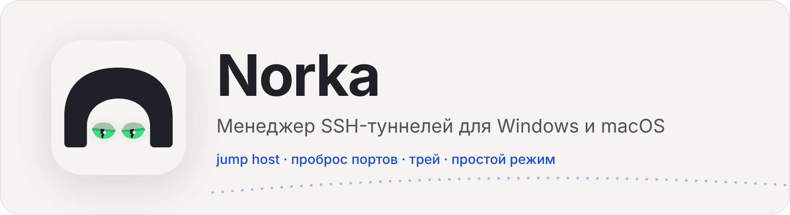
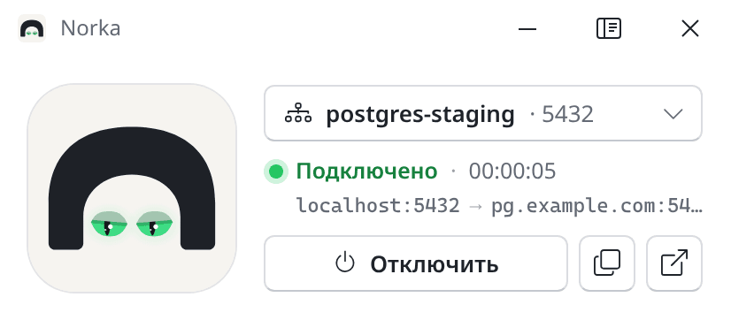
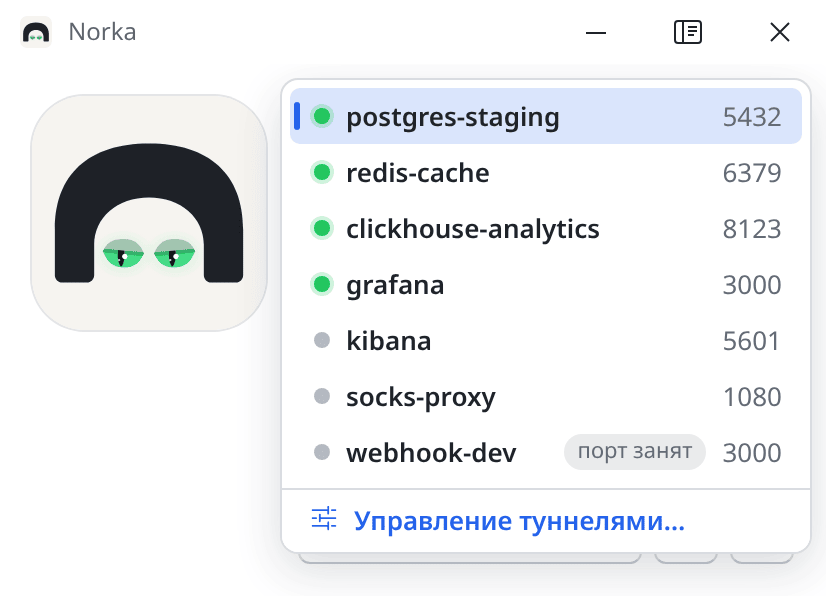
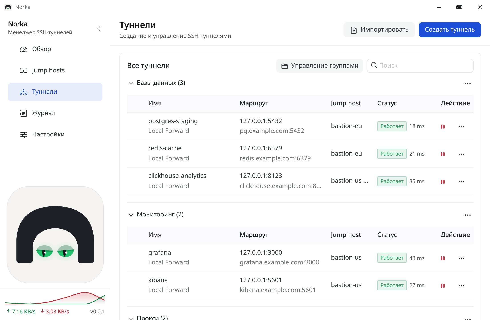
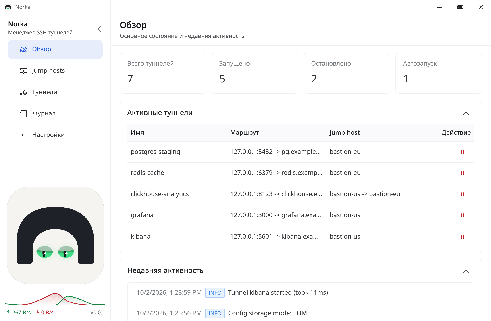
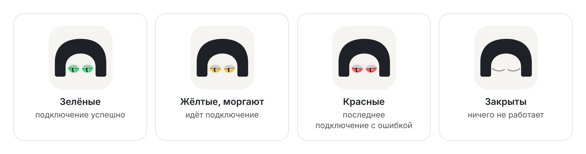
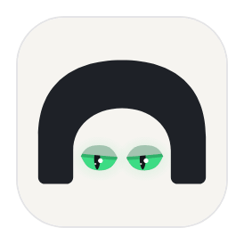

<div align="center">

<picture>
  <source media="(prefers-color-scheme: dark)" srcset="docs/images/banner-dark.png">
  
</picture>

**SSH-туннели в одном окне: подключил, свернул в трей, забыл.**

<sub>A tiny SSH tunnel manager for Windows and macOS with a burrow-dwelling mascot. The UI is in Russian.</sub>

<br>


[Скачать](../../releases) · [Возможности](#возможности) · [Сборка](#сборка-из-исходников) · [Конфигурация](#конфигурация)

</div>

---

## Что это

Norka создаёт и держит SSH-туннели из окна, без ручных команд на каждый запуск. Туннели ходят через один или несколько jump host. Если связь рвётся, приложение само переподключается и показывает статус в окне, в трее и глазами маскота.

<table>
<tr>
<td width="50%" valign="top">

**Простой режим** — компактное окно на один туннель

<picture>
  <source media="(prefers-color-scheme: dark)" srcset="docs/images/simple-dark.png">
  
</picture>

</td>
<td width="50%" valign="top">

**Быстрое переключение** — список туннелей прямо в окне

<picture>
  <source media="(prefers-color-scheme: dark)" srcset="docs/images/simple-list-dark.png">
  
</picture>

</td>
</tr>
</table>

**Расширенный режим** — обзор, jump host, туннели, журнал и настройки

<picture>
  <source media="(prefers-color-scheme: dark)" srcset="docs/images/advanced-tunnels-dark.png">
  
</picture>

<details>
<summary>Ещё скриншот: страница «Обзор»</summary>

<picture>
  <source media="(prefers-color-scheme: dark)" srcset="docs/images/advanced-overview-dark.png">
  
</picture>

</details>

<sub>Скриншоты — Windows, светлая и тёмная тема переключаются вместе с темой GitHub. Имена хостов вымышленные.</sub>

---

## Возможности

- 🕳️ **Туннели.** Local, remote и dynamic SOCKS5. Группы, поиск, копирование туннеля, автозапуск вместе с приложением, проверка доступности прямо из диалога создания.
- 🧭 **Jump host.** Пароль, файл ключа или SSH Agent, keepalive, таймаут, проверка подключения до сохранения. Цепочка из нескольких jump host на один туннель.
- 🪟 **Два режима окна.** Расширенный — полный интерфейс. Простой — компактное окно на один туннель: статус, адрес, время работы, копирование адреса и открытие в браузере. Простое окно можно закрепить поверх остальных. Переключение — кнопкой в заголовке, из трея или сочетанием <kbd>Ctrl</kbd>+<kbd>Shift</kbd>+<kbd>M</kbd>.
- 🔌 **Конфликт портов.** Если локальный порт уже держит другой туннель, Norka помечает его «порт занят» и предлагает «Подключить вместо» — остановит мешающий туннель и запустит выбранный.
- 🧷 **Трей.** Иконка меняет цвет по общему статусу. У каждого туннеля своё подменю: подключить или отключить, скопировать адрес, открыть в браузере. Внизу — «Отключить все», «Переподключить ошибочные» и быстрый переход в простой или расширенный режим.
- 🔁 **Переподключение.** После обрыва экспоненциальная пауза от 0,5 с до 1 минуты, попытки до 15 минут. В списке это статус «Переподключение».
- 📈 **Трафик и задержка.** Скорость и график в боковой панели, задержка SSH у каждого работающего туннеля.
- 📥 **Импорт.** Туннели из команды `ssh` (`-L`, `-R`, `-D`). Jump host из файла SSH config, включая `ProxyJump`.
- 🧾 **Журнал** операций с фильтром по уровню.
- 🎨 **Оформление.** Светлая и тёмная тема, собственная строка заголовка без системной рамки на Windows (на macOS — нативная).
- ⚙️ **Настройки.** Запуск при входе в систему, экспорт и импорт `config.toml`, свой каталог конфигурации.

---

## Норка смотрит за туннелями

Маскот в боковой панели и в простом режиме показывает общий статус глазами, иконка в трее меняет цвет так же. При успешном подключении норка подмигивает, а в простое иногда моргает, оглядывается и может задремать.

Оба глаза всегда одного цвета и показывают последнее событие. Подключение упало — глаза красные, даже если другие туннели работают. Следующее успешное подключение или остановка упавшего туннеля снова делает их зелёными.

<picture>
  <source media="(prefers-color-scheme: dark)" srcset="docs/images/status-eyes-dark.png">
  
</picture>

| Глаза | Что значит |
|---|---|
| 🟢 Зелёные | подключение прошло успешно, туннели работают |
| 🟡 Жёлтые, моргают | идёт подключение или переподключение |
| 🔴 Красные | последнее подключение с ошибкой |
| 😴 Закрыты | ничего не работает |

<details>
<summary>🤫 А если очень настойчиво потыкать в норку…</summary>
<br>

<picture>
  <source media="(prefers-color-scheme: dark)" srcset="docs/images/knockout-birds-dark.gif">
  
</picture>

Это одна из нескольких анимаций. Остальные найдите сами 🙂

</details>

---

## Установка

Готовые сборки — в [Releases](../../releases):

| Система | Файл |
|---|---|
| macOS (Intel и Apple Silicon) | `norka.dmg` — перетащите Norka в «Программы» |
| Windows (x64) | `norka.exe` |

Сборки публикует GitHub Actions по тегу `v*`.

### Первый запуск на macOS

Сборка подписывается ad-hoc, без сертификата разработчика. Если система блокирует приложение:

1. В окне предупреждения нажмите «Отменить».
2. Откройте «Системные настройки» → «Конфиденциальность и безопасность».
3. Нажмите «Всё равно открыть».

Либо в Терминале:

```bash
sudo xattr -rd com.apple.quarantine /Applications/norka.app
```

Путь замените на тот, куда установлен `.app`.

---

## Режимы туннеля

| Режим | Поле `mode` | Что делает |
|------|-------------|------------|
| Local Forward | `local` | Локальный порт открывается на удалённый адрес через SSH |
| Remote Forward | `remote` | Порт на SSH-сервере открывается на локальный адрес |
| Dynamic SOCKS5 | `dynamic` | SSH-сервер работает как SOCKS5-прокси |

---

## Сборка из исходников

Нужны:

- [Go](https://go.dev/dl/) 1.25 или новее (в CI стоит 1.26)
- [Node.js](https://nodejs.org/) 18 или новее и [pnpm](https://pnpm.io/) 10 (в CI — Node.js 24)
- [Wails CLI](https://wails.io/docs/gettingstarted/installation) v2.16

```bash
git clone https://github.com/norka-app/Norka.git
cd Norka

cd frontend && pnpm install && cd ..

wails dev     # режим разработки с горячей перезагрузкой
wails build   # сборка в build/bin
```

`wails build` без `-platform` собирает программу для текущей системы. В CI: `darwin/universal` и `windows/amd64`.

---

## Конфигурация

Файл — TOML. Каталог и права: каталог `0700`, файл `0600`.

Куда пишется конфиг, если каталог не переопределён:

- **`wails dev`** (задана переменная `devserver`): `./config.toml`, если текущий каталог доступен на запись. Иначе `~/.norka/config.toml`.
- **Собранная программа**, в том числе автозапуск при входе: `~/.norka/config.toml`.

Если файла нет или он пустой, Norka создаёт его с пустыми списками.

Свой каталог задаётся в настройках. Рядом с исходным `config.toml` появляется файл `config.root` с абсолютным путём. Туда копируются `config.toml` и `ui.locale`. Если в целевой папке файлы уже есть, можно перезаписать их или оставить. После смены каталога приложение закрывается.

<details>
<summary>Пример <code>config.toml</code></summary>

```toml
version = 1
auto_run = false
traffic_monitor_enabled = true

[[jumpers]]
id = 1
name = "my-server"
host = "example.com"
port = 22
user = "ubuntu"
auth_type = "ssh_agent"   # password | ssh_key | ssh_agent
# key_path = "~/.ssh/id_rsa"

[[groups]]
id = 1
name = "Базы"

[[tunnels]]
id = 1
name = "local-db"
group_id = 1
jumper_ids = [1]
mode = "local"             # local | remote | dynamic
local_host = "127.0.0.1"
local_port = 5432
remote_host = "127.0.0.1"
remote_port = 5432
auto_start = true
status = "stopped"
```

</details>

Для `dynamic` поля `remote_host` и `remote_port` не нужны. Пароль jump host хранится в этом файле.

---

## Структура проекта

```text
.
├── main.go, app.go          # точка входа Wails и API для фронтенда
├── tray_menu.go, tray_model.go   # меню и иконка трея
├── window_*.go              # режимы окна, собственный заголовок на Windows
├── internal/
│   ├── biz/                 # туннели, jump host, группы, конфликты портов
│   ├── forward/             # SSH-подключения и проброс портов
│   ├── conf/                # чтение и запись config.toml
│   ├── sshconfig/           # импорт из SSH config
│   ├── autostart/           # запуск при входе в систему
│   └── ...
├── frontend/                # Vue 3 + Vite + Naive UI
│   └── src/components/
│       ├── norka/           # маскот: глаза, моргание, пасхалка
│       ├── simple/          # простой режим
│       ├── layout/          # заголовок, боковая панель
│       └── pages/           # обзор, jump host, туннели, журнал, настройки
├── build/                   # иконки приложения и трея, манифесты
└── .github/workflows/       # сборка .dmg и .exe, публикация релиза
```

## Стек

| Слой | Технология |
|------|------------|
| Оболочка | [Wails](https://wails.io/) v2.16 |
| Бэкенд | Go 1.25 |
| Интерфейс | Vue 3, Vite, Naive UI |
| SSH | `golang.org/x/crypto/ssh` |
| Трей | `github.com/energye/systray` |
| Конфиг | TOML (`github.com/BurntSushi/toml`) |

---

## Лицензия

MIT. Текст — в файле [LICENSE](LICENSE).
